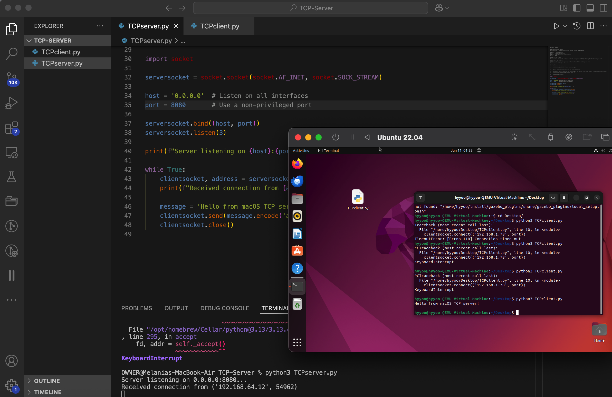

# Basic-Penetration-Testing-Skills

This repository contains **four individual mini-projects** focused on network communication using Python and socket programming:

1. **TCP Server & Client**
2. **Nmap Scanner**
3. **Banner Grabber**
4. **Port Scanner**

Each project demonstrates foundational networking concepts such as socket communication, service discovery, and port scanning.

## 🧪 Demo: TCP Server/Client Output

This project demonstrates basic TCP communication using Python sockets between a **server on macOS** and a **client on Ubuntu 22.04** (running inside a virtual machine).

---

### 🖥️ Setup Details

- **Server OS:** macOS (host)
- **Client OS:** Ubuntu 22.04 (guest VM on UTM)
- **Communication Port:** 8080
- **Local IPs:** 
  - macOS: Automatically bound to `0.0.0.0` (all interfaces)
  - Ubuntu client connects using the macOS IP (e.g., `192.168.64.12`)

---

### ✅ Example Output

**macOS Terminal (Server Side):**
```bash
$ python3 TCPServer.py
Server listening on 0.0.0.0:8080...
Received connection from ('192.168.64.12', 54962)
```

**Ubuntu Terminal (Client Side):**
```bash
$ python3 TCPClient.py
hello from macOS TCP server!
```


## 🧪 Demo: Nmap Scanner Output

### 🖥️ Development Environment

This project was developed and tested using:

- **OS:** Kali Linux 
- **Python Version:** 3.x
- **Nmap Version:** 7.95
- **IP Address:** YOUR_LOCAL_IP *(can be obtained via `ifconfig`)*

> ⚠️ Note: Some tools (like the Nmap Scanner) require **Kali Linux** or another penetration testing distro with Nmap and networking permissions configured.

You can try the demo with **all three types of scans** to observe how the results differ for SYN ACK, UDP, and Comprehensive scans.

```bash
$ python3 Nmap_scanner.py
Welcome, this is a simple nmap automation tool.
Please enter the IP address you want to scan: 192.168.1.78
Please enter the type of scan you want to run
  1) SYN ACK Scan
  2) UDP Scan
  3) Comprehensive Scan
> 1
Nmap Version: (7.95)
IP Status: up
Open Ports: [53]
```

## 🧪 Demo: Banner Grabber Output

### Local Environment

- **Target IP:** YOUR_LOCAL_IP *(can be obtained via `ifconfig`)*
- **Open Port:** 22 (SSH service running)
- **Closed Port:** 1 (no service running)
📝 Note: Port 22 was open on my system because SSH was enabled on my laptop. Port availability may vary on different systems depending on which services are running.

---

### ✅ Example 1: Grabbing Banner from Open Port (22)

```bash
$ python3 BannerGrabber.py
Please enter the IP: 192.168.1.78
Please enter the port: 22
'SSH-2.0-OpenSSH_9.9\r\n'
```

### ✅ Example 2: Attempting to Grab Banner from Closed Port (1)

```bash
$ python3 BannerGrabber.py
Please enter the IP: 192.168.1.78
Please enter the port: 1
Traceback (most recent call last):
  ...
ConnectionRefusedError: [Errno 61] Connection refused
```


## 🧪 Demo: Port Scanner Output

### 🔍 Step 1: Verify Target Host Is Reachable

Before scanning ports, it's good practice to check whether the target server is online using `ping`.

```bash
$ ping hackthissite.org
PING hackthissite.org (137.74.187.103): 56 data bytes
64 bytes from 137.74.187.103: icmp_seq=0 ttl=48 time=263.500 ms
```
### Step 2: Scan ports

```bash
$ python3 PortScanner.py
Please enter the IP you want to scan: 137.74.187.103
Please enter the port you want to scan: 21
The port is closed

$ python3 PortScanner.py
Please enter the IP you want to scan: 137.74.187.103
Please enter the port you want to scan: 80
The port is open
```

## Credits:

Instructions for building these projects can be found at: 
https://www.freecodecamp.org/learn/information-security/